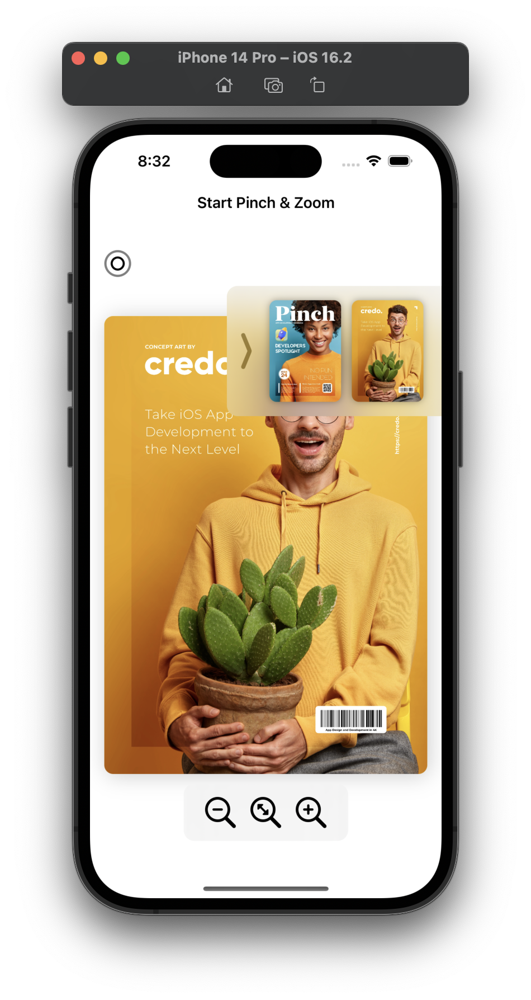
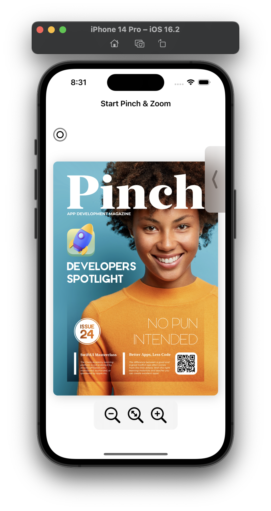

<!-- ABOUT THE PROJECT -->
<h1 align="center">
  <br>
    <a href="#" target="_blank"></a>
  <br>
  <p>Zoomin</p>
</h1>

### Preview
<p align="center">
  <a href="#" target="_blank"></a>
  <a href="#" target="_blank"></a>
</p>

<!-- ABOUT THE FILE & FOLDER STRUCTURE -->
## Folder & File Structure
Berikut struktur file dan folder pada Zoomin:

    .
    ├── ZoominApp.swift             # Root Project: Konfigurasi ContentView
    ├── Assets                      # Aset Logo & Gambar
    ├── Data                        # Data: Berisikan Static Data Declaration
    │   └── PageData.swift          # Berisikan Static Data Declaration For Image Sample in Home Page
    │
    ├── Model                       # Model: Berisikan Struct Data Type Declaration 
    │   └── PageData.swift          # Berisikan Data Type Declaration for Thumbnail Page & Extension Thumbnail Caller
    │
    ├── Screen                      # Screen: Berisikan Main Screen / Page
    │   └── ContentView.swift       # Tampilan Home Page
    │
    └── View                        # Berisikan Reusable Components
        ├── InfoPanelView.swift     # Components Info Panel & Holdable Tap (Hotspot)
        └── ControlImageView.swift  # Components Button Reuable Button

<!-- List of Features -->
## Features:

* Widgets & Properties
* All Stacks (HStack, VStack, ZStack)
* Zoom In, Zoom Out, Hold Tap, Pinch, & Drag Gestures
* Custom Drawer For Each Thumbnails
* Declarative UI with @State
* Importation Assets

<!-- Used Tools -->
## Build With:

* [Swift](https://www.swift.org/documentation/)
* [SwiftUI](https://developer.apple.com/documentation/swiftui/)
* [Xcode](https://developer.apple.com/xcode/)

<!-- How to Install -->
## Installation
Untuk menggunakan repositori ini, ikutilah petunjuk penggunaan berikut dan pastikan git sudah terinstall pada komputer (semua perintah dilaksanakan pada `cmd.exe` atau `terminal`):

1. Lakukan download .zip atau `clone` repositori dengan cara:
```bash
git clone https://github.com/dekapd99/Zoomin.git
```

2. Jika sudah Download / Clone Project, silahkan buka Project di Xcode dengan Klik Open a Project or File.
3. Pastikan untuk memilih iPhone 14 pada Target Simulator (Kolom Device dibagian atas XCode). 
4. Build & Run

<!-- What Kind of License? -->
## License
MIT License: Copyright (c) 2022 
Deka

DISCLAIMER: ASSETS ARE USED FOR EDUCATION PURPOSE ONLY, NOT FOR COMMERCIAL PURPOSES

Assets Source: GOOGLE IMAGE & [SF SYMBOLS 4 ICON](https://developer.apple.com/sf-symbols/)

<p align="right">(<a href="#top">back to top</a>)</p>
